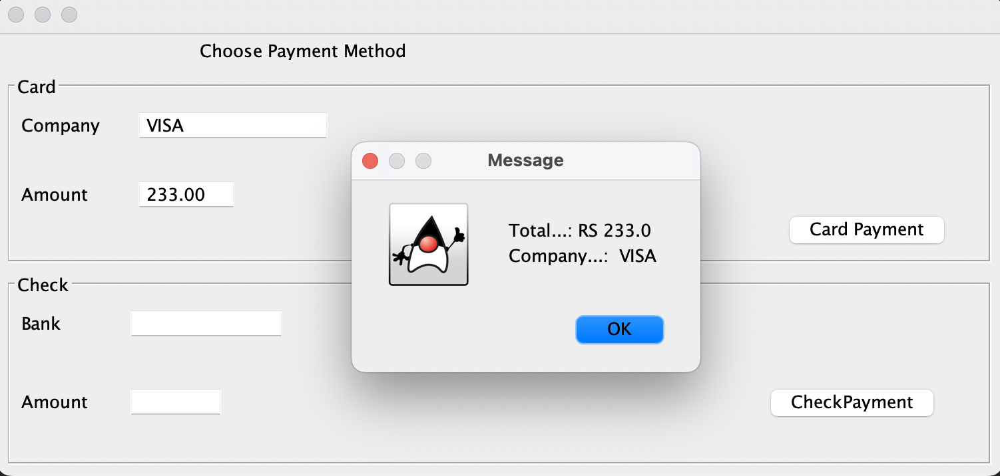

# Concrete factory hands-on

Repository with source code to be used by the students as a starting point to the hands-on and source code with one possible solution to the hands-on. 

In this exercise, the student must evolve a working code that creates one type of payment (Check or Credit Card). The current version was not implemented using the Factory concept. Evolve the code to use the Concrete Factory technique.

 

 

## Exercise

We provide some initial code for the exercise. It is bundled in a Apache Maven Project and located on the folder Exercise in this repository.

## Exercise solution

Solution of the exercise. It is bundled in a Apache Maven Project and located on the folder Solution in this repository.
